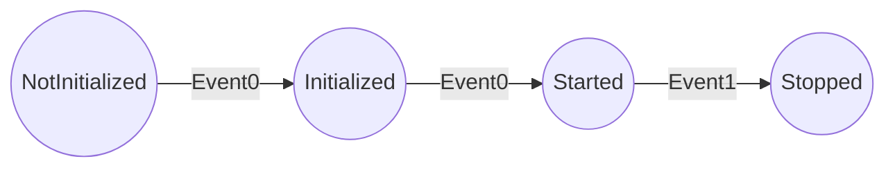

# FSM

This project is maintained on [gitlab](https://gitlab.com/lelongg/fsm).

## Overview

FSM is a single header static finite state machine library.

You can define transitions from state to state given any event type and all transitions are built at compile time, leaving next to nothing to be done at runtime.

**Warning**: this library is **experimental** and has not been reviewed.

Contributions are welcome.

## Prerequisites

This project relies heavily on modern template features of **C++14**.

## Quickstart

Just drop [fsm.h](include/fsm/fsm.h) in your project.

## Usage

Please take a look at [fsm_tests.cpp](tests/fsm_tests.cpp) as it's a short but complete example of FSM usage.
Samples are detailed below.

We define our event types.
An event can be any type, yours or others.

```c++
struct Event0 {};
struct Event1 {};
```

Next we define what our states will be as an enumeration.

```c++
enum State
{
    NotInitialized,
    Initialized,
    Started,
    Stopped
};
```

Here we create the actual state machine.
Its template parameters are the state enumeration and an unbounded list of transitions.
Template parameters of transitions are:

- the initial state for the transition to take place
- the event triggering the transition
- the final state for this transition

In this case, our state machine looks like the following graph.



Finally, our constructor takes the initial state as an argument.

```c++
FSM<State,
    Transition<NotInitialized, Event0, Initialized>,
    Transition<Initialized, Event0, Started>,
    Transition<Started, Event1, Stopped>>
    fsm(NotInitialized);
```

We can then process incoming events with `process` which will update the state machine and also return its new state.

```c++
fsm.process(Event1());
```

## Tests

This project use [meson](https://mesonbuild.com/) and [ninja](https://ninja-build.org/) as build tool.
You can build and run tests with the following commands.

```bash
meson build
ninja -C build test
```
